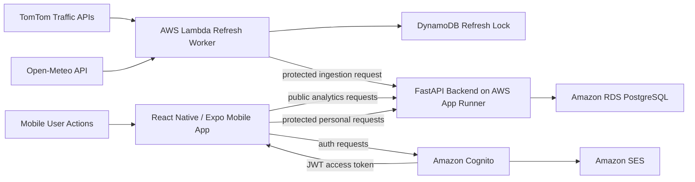

# Traffiq

Traffiq is an end-to-end traffic intelligence data engineering project for the city of Suceava, Romania.

It collects mobility-related data, processes it through Python ETL pipelines, stores it in PostgreSQL analytical layers, exposes the results through a FastAPI backend, deploys the backend on AWS, and presents the final product through a React Native / Expo mobile app.

The project is designed as a serious portfolio and license project for a Junior Data Engineer profile. It is not positioned as a Waze clone or a full production navigation platform.

## Why This Project Exists

Traffic intelligence data is usually fragmented across multiple sources:

- traffic flow observations
- traffic incidents and road events
- weather conditions
- route information
- user-specific ride history and saved routes

Traffiq answers a practical data engineering question:

> How can raw mobility, weather, route, and user data be ingested, modeled, served, secured, and consumed by a real application?

The result is a complete data product:

```text
data sources -> ETL -> PostgreSQL analytical layers -> FastAPI -> mobile app -> AWS deployment
```

## Demo

Demo media will be added here:

- mobile app walkthrough video
- screenshots of the Drive, Route Preview, Traffic Profile, Account, History, and Pipeline Status screens
- short API demonstration

The mobile app is built as an installable Android preview APK through EAS Build. It runs from the phone launcher and does not require Expo Go or a development PC for the final demo.

## Live Backend

The FastAPI backend is deployed publicly on AWS App Runner:

```text
https://eguwdq6puz.eu-central-1.awsapprunner.com
```

Example public checks:

```powershell
Invoke-RestMethod https://eguwdq6puz.eu-central-1.awsapprunner.com/health
Invoke-RestMethod https://eguwdq6puz.eu-central-1.awsapprunner.com/mobile/drive-overview
Invoke-RestMethod https://eguwdq6puz.eu-central-1.awsapprunner.com/mobile/traffic-profile
Invoke-RestMethod https://eguwdq6puz.eu-central-1.awsapprunner.com/pipeline/status
```

The backend is public so the mobile app can use it from any phone. Personal data is not public. Ride history, saved routes, preferences, and auth introspection require an Amazon Cognito JWT.

If the API is unavailable, the AWS demo resources may be paused to control cost.

## What It Demonstrates

Traffiq demonstrates practical skills expected from a Junior Data Engineer:

- Python ETL design
- pandas transformation logic
- PostgreSQL schema design
- Bronze / Silver / Gold / Serving data modeling
- pipeline metadata and data quality checks
- API serving with FastAPI
- protected personal data access with JWT authentication
- cloud deployment on AWS
- Dockerized local runtime
- mobile client consumption of backend-shaped analytical data
- cost-aware cloud architecture
- clear documentation of real data, fallback data, and project limitations

## Architecture



### Runtime Flow

```text
Mobile app
   -> calls AWS Lambda refresh URL when the app opens
   -> Lambda reads TomTom and Open-Meteo
   -> Lambda sends the snapshot to a protected FastAPI ingestion endpoint
   -> FastAPI stores the result in RDS
   -> mobile app reads fresh API-ready data from FastAPI
```

A DynamoDB lock limits refresh frequency so the project remains safe for API quota and cost.

## Data Engineering Pipeline

The project follows a layered analytical data model:

```text
Bronze -> Silver -> Gold -> Serving
```

| Layer | Purpose | Examples |
| --- | --- | --- |
| Bronze | Raw or near-raw source data for traceability | TomTom flow raw, TomTom incident raw, weather raw, event raw |
| Silver | Cleaned and standardized records | traffic observations, current weather, saved routes, user ride history |
| Gold | Business-level analytical outputs | current corridor traffic, hourly traffic profile, route summaries |
| Serving | API-ready views | mobile overview, route reports, weather impact, map events |
| ETL metadata | Operational visibility | pipeline runs, data quality checks |

Important implementation areas:

```text
src/extract/      -> source extraction logic
src/transform/    -> pandas cleaning and normalization
src/load/         -> PostgreSQL writes
src/pipeline/     -> orchestration and safety checks
sql/ddl/          -> database schemas, tables, views, indexes
src/api/          -> FastAPI serving layer
```

## Data Sources

| Source | Used for | Notes |
| --- | --- | --- |
| TomTom Traffic Flow API | current traffic speed and congestion on monitored Suceava corridors | real traffic snapshots |
| TomTom Traffic Incidents API | current road incidents in the Suceava area | real incident snapshots |
| Open-Meteo API | current weather context | free public weather source |
| Mobile user actions | ride history, saved routes, preferences | protected per Cognito user |
| Controlled baseline data | traffic profile fallback until enough observations exist | documented fallback, not presented as full-city live traffic |

The final mobile experience uses real TomTom and Open-Meteo data for the current traffic surface. The traffic profile also includes a baseline so the chart remains useful before a full week of hourly observations has been collected.

## PostgreSQL Model

Main schemas:

```text
bronze
silver
gold
serving
etl_meta
```

Representative tables and views:

- `bronze.tomtom_flow_raw`
- `bronze.tomtom_incidents_raw`
- `silver.tomtom_flow_observations`
- `silver.tomtom_incidents`
- `silver.current_weather_snapshot`
- `silver.user_ride_history`
- `silver.saved_routes`
- `gold.current_corridor_traffic`
- `gold.corridor_hourly_traffic_profile`
- `serving.vw_top_congested_segments`
- `serving.vw_map_events`
- `etl_meta.pipeline_runs`
- `etl_meta.data_quality_checks`

This structure is intentionally more than a CRUD database. It shows separation between raw ingestion, cleaned data, analytical outputs, and API consumption.

## Backend API

The backend is built with FastAPI and serves both public analytical data and protected personal data.

### Public Endpoints

| Endpoint | Purpose |
| --- | --- |
| `GET /health` | service health check |
| `GET /mobile/drive-overview` | backend-for-frontend response for the Drive screen |
| `GET /mobile/traffic-profile` | 7 day x 24 hour traffic profile for Suceava |
| `POST /routes/preview` | route distance, duration, and geometry |
| `GET /map/events` | map-ready traffic events |
| `GET /pipeline/status` | latest ETL run and data quality checks |
| `GET /reports/overview` | public reporting summary |

Example route preview request:

```powershell
$body = @{
  origin_name = "Current location"
  origin_latitude = 47.6514
  origin_longitude = 26.2556
  destination_name = "Iulius Mall Suceava"
  destination_latitude = 47.6693
  destination_longitude = 26.2774
} | ConvertTo-Json

Invoke-RestMethod `
  -Uri https://eguwdq6puz.eu-central-1.awsapprunner.com/routes/preview `
  -Method Post `
  -ContentType "application/json" `
  -Body $body
```

### Protected Endpoints

| Endpoint | Purpose |
| --- | --- |
| `GET /rides/history` | current user's ride history |
| `POST /rides/history` | save a completed ride |
| `DELETE /rides/history/{ride_id}` | delete a ride |
| `GET /saved-routes` | current user's saved routes |
| `POST /saved-routes` | save a route |
| `DELETE /saved-routes/{saved_route_id}` | delete a saved route |
| `GET /preferences` | current user's preferences |
| `PUT /preferences` | update preferences |
| `GET /auth/me` | validate authenticated user context |

Protected endpoints require a Cognito access token and filter rows by the authenticated user identity. Public endpoints do not expose personal ride history, saved routes, or preferences.

## Mobile App

The mobile app is built with React Native, Expo, and TypeScript.

Main screens:

- Drive
- Ride History
- Account
- Pipeline Status

Product features:

- Suceava-focused route planning
- search suggestions for real Suceava locations
- route preview with distance, duration, and map geometry
- map polyline and destination marker
- real TomTom incident markers
- live GPS speed display on expanded map
- current route confirmation flow
- save route
- start drive and save ride history
- protected saved routes and preferences
- traffic profile chart by weekday and hour
- Cognito account creation, confirmation, login, and forgot password
- branded Cognito email template
- installable Android APK through EAS Build

## AWS Deployment

Traffiq uses a low-cost AWS architecture suitable for a portfolio project:

| AWS service | Role |
| --- | --- |
| AWS App Runner | runs the public FastAPI backend |
| Amazon ECR | stores the backend Docker image |
| Amazon RDS PostgreSQL | stores analytical and personal data |
| Amazon Cognito | handles user accounts and JWT authentication |
| Amazon SES | sends branded account confirmation and password reset emails |
| AWS Lambda | refreshes TomTom and Open-Meteo snapshots on app use |
| Amazon DynamoDB | rate-limits refresh attempts through a lightweight lock |
| AWS SSM Parameter Store | stores runtime secrets such as API keys and DB password |

Deliberately avoided for cost control:

- Kubernetes
- NAT Gateway
- Multi-AZ RDS
- always-on EC2 workers
- push notification infrastructure
- enterprise-scale streaming infrastructure

## Security And Privacy

Security decisions implemented in the project:

- no AWS access keys, DB passwords, or API tokens committed to Git
- App Runner reads database secrets through AWS-managed runtime configuration
- TomTom API key is never shipped inside the mobile APK
- mobile app calls a public Lambda refresh URL, not TomTom directly
- protected ingestion endpoint requires a server-side token
- Cognito issues JWTs for authenticated users
- FastAPI validates Cognito access tokens before returning personal data
- saved routes, ride history, and preferences are scoped to the current user
- public reports do not expose personal ride history

## Validation

Final release validation included:

```text
npx tsc --noEmit -> passed
python -m compileall -q src -> passed
npx expo-doctor --verbose -> 18/18 checks passed
npx expo export --platform android -> passed
GET /health -> status=ok
GET /mobile/drive-overview -> TomTom data returned
GET /mobile/traffic-profile -> 168 hourly rows returned
GET /pipeline/status -> latest TomTom pipeline run returned
GET /rides/history without token -> 401
GET /preferences without token -> 401
POST /routes/preview -> 200
App Runner -> RUNNING
Cognito email verification -> enabled
SES sender -> verified
secret scan -> no committed AWS access keys found
```

Python unit tests are present under `tests/`, but `pytest` is not required for the deployed demo runtime and was not installed in the local virtual environment during the final release check.

## Local Development

### Docker Backend

From the repository root:

```powershell
docker compose up --build
```

Validate locally:

```powershell
Invoke-RestMethod http://localhost:8000/health
```

### Mobile Development

```powershell
cd mobile
npx.cmd expo start --clear
```

By default, the mobile app points to the public AWS backend. For local backend testing, set:

```powershell
$env:EXPO_PUBLIC_TRAFFIQ_API_BASE_URL="http://YOUR_LOCAL_IP:8000"
npx.cmd expo start --clear
```

Do not commit local `.env` files or secrets.

## Repository Structure

```text
data/                  local raw/demo data inputs
docker/                Docker runtime files
docs/                  architecture, AWS, validation, and demo documentation
mobile/                React Native / Expo mobile app
sql/ddl/               PostgreSQL schemas, tables, views, indexes
src/api/               FastAPI backend
src/cloud/             Lambda refresh worker code
src/config/            configuration loading
src/extract/           extraction modules
src/transform/         transformation modules
src/load/              database load modules
src/pipeline/          ETL orchestration
src/utils/             shared utilities
tests/                 unit tests
```

## Documentation Map

Best starting points:

- [Architecture Walkthrough](docs/ARCHITECTURE_WALKTHROUGH.md)
- [Final Project Summary](docs/FINAL_PROJECT_SUMMARY.md)
- [Demo Flow](docs/DEMO_FLOW.md)
- [Android APK Demo Build](docs/ANDROID_APK_DEMO_BUILD.md)
- [AWS App Runner Backend](docs/AWS_APP_RUNNER_BACKEND.md)
- [AWS RDS PostgreSQL](docs/AWS_RDS_POSTGRESQL.md)
- [AWS Cognito User Pool](docs/AWS_COGNITO_USER_POOL.md)
- [Personal Feature Protection](docs/PERSONAL_FEATURE_PROTECTION.md)
- [Secrets And Config](docs/SECRETS_AND_CONFIG.md)
- [TomTom Refresh On Use](docs/TOMTOM_REFRESH_ON_USE.md)

## Project Scope And Limitations

Traffiq intentionally focuses on Suceava.

Current limitations:

- not a full real-time navigation engine
- not a Waze clone
- no multi-city support
- no user-generated incident reports
- no push notifications
- no full-city continuous traffic tracking
- TomTom refresh is rate-limited for cost and quota safety
- traffic profile uses baseline values until enough observed TomTom history is collected

These limitations are deliberate. The project is designed to demonstrate a complete data engineering system, not to compete with commercial navigation platforms.

## How I Would Explain This In An Interview

Traffiq is a data engineering product that connects ingestion, transformation, storage, API serving, authentication, cloud deployment, and a mobile user interface.

The strongest engineering decisions are:

- using Bronze / Silver / Gold / Serving layers instead of loading everything directly into API tables
- separating public analytical endpoints from protected personal endpoints
- keeping API keys and database credentials out of the mobile app and Git repository
- using AWS App Runner and Lambda for a low-cost cloud deployment instead of over-engineering the infrastructure
- documenting real data, fallback data, and project limitations clearly

This project demonstrates that I can think beyond isolated scripts. I can design a data system that collects data, validates it, models it, serves it, secures it, deploys it, and presents it in a usable application.
