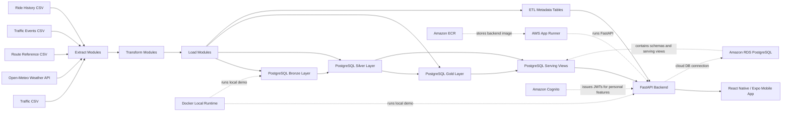
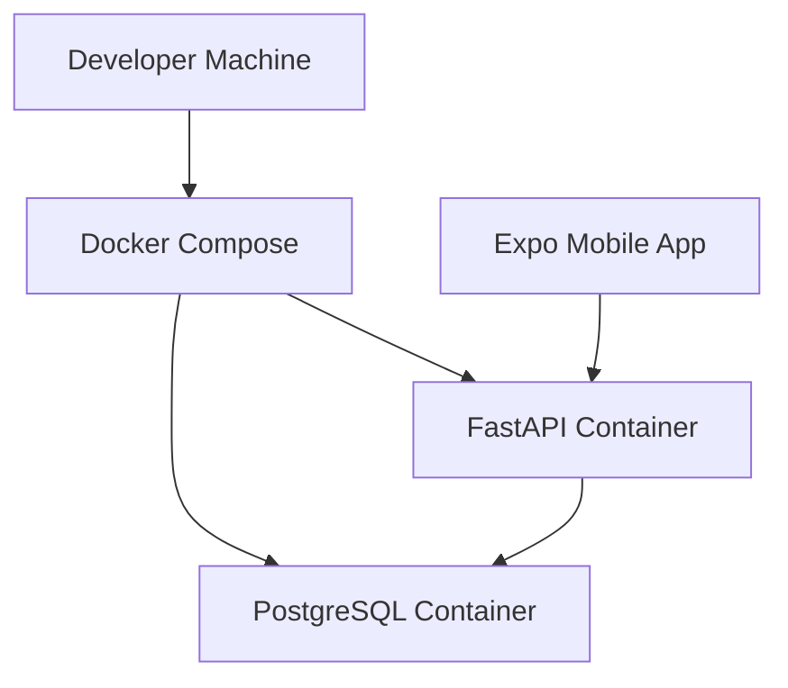

# Architecture Diagram And Technical Walkthrough

## Purpose

This document explains Traffiq's final v4 architecture in a way that can be used for technical review, recruiter discussion, and future development planning.

The project is built as an end-to-end data product:

```text
data sources -> ETL pipeline -> PostgreSQL analytical layers -> FastAPI -> mobile app
```

## High-Level Architecture



## Runtime Architecture



Local Docker is used to run the backend stack in a reproducible way. The mobile app can run through Expo Go and call either the local backend override or the public AWS App Runner API. By default, the current mobile configuration points to the public cloud API.

## Data Flow Walkthrough

### 1. Data Sources

Traffiq currently uses controlled sources that keep the project stable and demo-friendly:

- traffic CSV for base traffic observations
- Open-Meteo API for weather data
- route reference CSV for route definitions
- events CSV for traffic incidents and warnings
- ride history CSV for previous ride summaries

This is intentional for the portfolio scope. It gives the project realistic data engineering structure without depending on paid traffic APIs or pretending to provide Waze-like live traffic.

### 2. Extract Layer

Extract modules live in:

- `src/extract/`

Their job is to read external or raw input data and convert it into pandas DataFrames.

Examples:

- `extract_traffic_csv.py`
- `extract_weather_api.py`
- `extract_events_csv.py`
- `extract_route_reference_csv.py`
- `extract_rides_history_csv.py`

The extract layer should not contain analytical business logic. It only gets data into the pipeline.

### 3. Transform Layer

Transform modules live in:

- `src/transform/`

Their job is to clean and standardize raw data before loading analytical tables.

Examples of transform responsibilities:

- convert timestamps
- remove invalid rows
- normalize event types
- standardize weather labels
- remove duplicates
- prepare fields for Silver tables

This is where data quality starts becoming visible.

### 4. Load Layer

Load modules live in:

- `src/load/`

Their job is to write DataFrames into PostgreSQL layers.

The project follows the common data warehouse pattern:

```text
Bronze -> Silver -> Gold -> Serving
```

### 5. Bronze Layer

Bronze stores raw or near-raw ingested data.

Current examples:

- `bronze.traffic_raw`
- `bronze.weather_raw`
- `bronze.events_raw`
- `bronze.rides_raw`

The purpose of Bronze is traceability. It keeps a version of what entered the system before heavier cleaning and analytical shaping.

### 6. Silver Layer

Silver stores cleaned, structured, analysis-ready records.

Current examples:

- `silver.traffic_observations`
- `silver.weather_observations`
- `silver.traffic_weather_enriched`
- `silver.route_reference`
- `silver.events_observations`
- `silver.ride_history`
- `silver.user_ride_history`
- `silver.saved_routes`
- `silver.user_preferences`

Silver is where the data becomes reliable enough to support Gold analytics.

### 7. Gold Layer

Gold stores business-level analytical outputs.

Current examples:

- `gold.hourly_street_metrics`
- `gold.weather_traffic_impact`
- `gold.route_summary`
- `gold.route_hourly_report`
- `gold.top_congested_segments`

Gold tables answer product questions, such as:

- which streets are congested
- how weather affects speed
- which route has higher congestion
- how route performance changes by hour
- what recent rides looked like

### 8. Serving Layer

Serving views live in:

- `sql/ddl/create_serving_views.sql`

The serving layer gives the API stable, frontend-ready datasets without forcing the API to query raw analytical tables directly.

This is useful because API needs and warehouse needs are not always identical. The warehouse can stay analytical, while the serving layer can shape data for mobile consumption.

### 9. ETL Metadata Layer

Operational metadata is stored in:

- `etl_meta.pipeline_runs`
- `etl_meta.data_quality_checks`

These tables answer operational questions:

- when did the pipeline run
- did it succeed
- how many records were extracted
- how many records were loaded
- what data quality checks ran
- how many records were removed during cleaning

This makes the project more realistic because real data pipelines need observability, not just transformations.

## Pipeline Orchestration

The main traffic-weather pipeline entrypoint is:

- `src/pipeline/run_pipeline.py`

It runs:

```text
traffic extract
traffic transform
traffic Bronze/Silver/Gold loads
weather extract
weather transform
weather Bronze/Silver loads
traffic-weather enrichment
weather impact Gold load
pipeline metadata logging
data quality checks
```

The demo/mobile seed entrypoint is:

- `src/pipeline/seed_demo_data.py`

It runs the main traffic-weather pipeline and then loads the extra data needed by the app:

```text
route reference
route summary
route hourly report
top congested segments
events
ride history
```

For cloud/RDS execution, destructive demo reloads require explicit confirmation flags. This prevents accidental resets of the managed cloud database.

## API Architecture

FastAPI is organized through route modules in:

- `src/api/routes/`

Current API areas:

- health
- auth
- traffic
- streets
- weather impact
- route reports
- route hourly reports
- route preview
- map events
- ride history
- saved routes
- preferences
- pipeline status
- reports overview
- mobile drive overview

The most important mobile API contract is:

- `GET /mobile/drive-overview`

This endpoint gives the mobile Drive screen one backend-shaped response instead of forcing the app to call many separate endpoints.

That is closer to production API design because the backend shapes the data contract for the client.

## Mobile Architecture

The mobile app lives in:

- `mobile/`

Important parts:

- `mobile/src/screens/DriveScreen.tsx`
- `mobile/src/screens/PipelineScreen.tsx`
- `mobile/src/services/traffiqApi.ts`
- `mobile/src/config/api.ts`
- `mobile/src/types/api.ts`
- `mobile/src/theme/theme.ts`

The current mobile app is a product-style traffic intelligence demo for Suceava. It is not a real navigation engine and does not promise live Waze-like traffic, but it presents data engineering outputs as a usable mobile experience.

The app consumes backend data through a shared API service layer, not direct fetch calls scattered across screens.

Current mobile behavior:

- Drive shows route planning, map, weather context, traffic alerts, route condition, and recent ride context.
- Route preview calculates distance, duration, and geometry.
- The map renders the route polyline, destination marker, and severity-coded alert markers.
- The route confirmation flow supports saving a route, changing a route, ending a route, and starting a drive.
- History, saved routes, and preferences are personal features protected by Cognito.
- Pipeline shows demo/admin observability from backend health and ETL metadata.

## Docker Architecture

Docker files:

- `Dockerfile`
- `docker-compose.yml`
- `docker/postgres/init.sql`

Docker runs:

- PostgreSQL container
- FastAPI container
- automatic database schema initialization
- automatic demo seeding before API startup

This makes the project easier to run on another machine and closer to deployable infrastructure.

Important distinction:

```text
Local Docker startup can seed demo data automatically.
Production API startup should not seed demo data automatically.
```

In production, API startup and ETL execution should be separated.

## AWS Architecture

The implemented AWS architecture is:

```text
Mobile app -> App Runner public FastAPI URL -> Amazon RDS PostgreSQL
Mobile app -> Cognito -> JWT -> protected FastAPI endpoints
Backend image -> Amazon ECR -> AWS App Runner
Controlled ETL/demo seed -> Amazon RDS PostgreSQL
```

This is documented in:

- `docs/CLOUD_WORKFLOW.md`
- `docs/AWS_ECR_BACKEND_IMAGE.md`
- `docs/AWS_APP_RUNNER_BACKEND.md`
- `docs/AWS_RDS_POSTGRESQL.md`
- `docs/AWS_COGNITO_USER_POOL.md`
- `docs/SCHEDULER_STRATEGY.md`
- `docs/SECRETS_AND_CONFIG.md`

Scheduled ETL through EventBridge Scheduler and ECS Fargate remains a later production-style improvement. The current demo keeps costs low by running controlled RDS loads only when needed.

## Why This Architecture Is Strong

Traffiq demonstrates the core responsibilities of a Junior Data Engineer:

- ingesting data from files and APIs
- cleaning data with Python and pandas
- modeling data in PostgreSQL
- separating Bronze, Silver, Gold, and Serving layers
- building analytics-ready outputs
- exposing data through FastAPI
- tracking pipeline runs and data quality checks
- deploying a backend-facing data product to AWS with cost-aware service choices

## Technical Summary

The concise explanation is:

```text
Traffiq is an end-to-end traffic intelligence data product for Suceava. It ingests traffic, weather, route, event, and ride data through Python ETL modules, models them in PostgreSQL using Bronze/Silver/Gold/Serving layers, exposes mobile-ready analytics through FastAPI, and presents the result in a React Native app. The current cloud demo uses ECR, App Runner, RDS PostgreSQL, and Cognito, while scheduled ETL with EventBridge and ECS Fargate remains the documented production-style next step.
```

The recruiter/demo narrative is documented in:

- `docs/DEMO_NARRATIVE.md`
